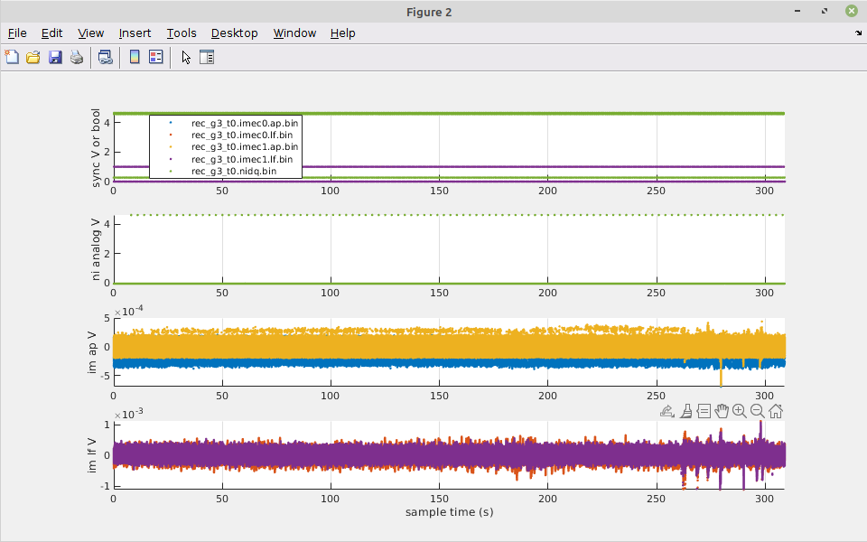
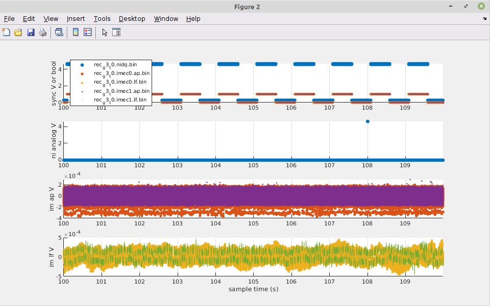

# spikeglx-tools-poc
Getting started with SpikeGlx Matlab and command line tools.

This repo contains proof of concept code for getting started with [SpikeGLX](https://billkarsh.github.io/SpikeGLX/) data files and associated Matlab and command line tools.  It might turn into some useful tools, or it might just be a stepping stone towards learning to work with SpikeGLX and similar data.

# What's here?

## SpikeGLX_Datafile_Tools

The folder `SpikeGLX_Datafile_Tools/` contains Matlab code from the SpikeGLX downloads page, specifically [Post-processing Tools](https://billkarsh.github.io/SpikeGLX/#post-processing-tools) (accessed 2022-11-07).  `DemoReadSGLXData.m` is included verbatim for reference.  Other m-files in this folder are subfunctions from `DemoReadSGLXData.m`, copy-pasted into ther own files so they can be reused.

Once minor exception: I modified [`ExtractDigital.m`](https://github.com/benjamin-heasly/spikeglx-tools-poc/blob/main/SpikeGLX_Datafile_Tools/ExtractDigital.m#L10) to return an extra value.  This exposes the file-wide channel index of a digital signal, which is calulated witihn this function, for reuse by the caller.

## Proof of concept code

I wrote two new functions that use the SpikeGLX_Datafile_Tools, to help get my head around SpikeGLX data files and metadata.

### PlotSpikeGlxRecordingSummary

`PlotSpikeGlxRecordingSummary.m` searches a given folder for SpikeGLX `.bin` data files.  This could be one of the raw data folders that SpikeGLX creates during recordings.

For each binary file found it prints a summary of the associated metadata.  This includes things like which type of card captured the data (Imec or National Instruments), what channels were configured, and where a sync signal was being recorded.  The output here combines raw metadata recorded by SpikeGLX during recording, plus commentary and interpretation that I took from the SpikeGLX [User Manual](https://billkarsh.github.io/SpikeGLX/Sgl_help/UserManual.html) and [Metadata reference](https://billkarsh.github.io/SpikeGLX/Sgl_help/Metadata_30.html)

Here's some sample output for a National Instruments card.

```
nidq PCIe-6321: rec_g3_t0.nidq.bin
0 multiplexed neural signed 16-bit channels: 
0 multiplexed aux analog signed 16-bit channels: 
2 non-muxed aux analog signed 16-bit channels: 0:1
0 non-muxed aux digital unsigned 16-bit words: 
308.998063 seconds at 32000.00Hz over 2 channels (19775876 samples)
39551752 bytes at 2 bytes per sample (19775876 samples)
Sync signal (source NI) is on analog channel 2
First sample: 80733231
User notes: 
```

For the action potential channels of an Imec Neuropixels probe.

```
imec probe NP1010 (serial 19398203272): rec_g3_t0.imec0.ap.bin
384 16-bit action potential channels
0 16-bit local field potential channels
1 single 16-bit sync input channel (bit 6)
Saved channels (AP 0:383, LF 384:767, SY 768): 0:383,768
Full channel map: (384,384,1)(AP0;0:0)(AP1;1:1)(AP2;2:2)(AP3;3:3)(AP4;4:4) [ ... continued ]
Sync source is NI
308.998610 seconds at 30000.02Hz over 385 channels (3568936140 samples)
7137872280 bytes at 2 bytes per sample (3568936140 samples)
First sample: 75687780
User notes: 
```

And for the local field potential channels of the same probe.

```
imec probe NP1010 (serial 19398203272): rec_g3_t0.imec0.lf.bin
0 16-bit action potential channels
384 16-bit local field potential channels
1 single 16-bit sync input channel (bit 6)
Saved channels (AP 0:383, LF 384:767, SY 768): 384:768
Full channel map: (384,384,1)(LF0;384:384)(LF1;385:385)(LF2;386:386)(LF3;387:387)(LF4;388:388) [ ... continued ]
Sync source is NI
308.998610 seconds at 2500.00Hz over 385 channels (297411345 samples)
594822690 bytes at 2 bytes per sample (297411345 samples)
First sample: 6307315
User notes: 
```

This is all still pretty dense, but it helped me undetstand how to read SpikeGLX metadata in general, and what was in my sample data files in particular.  With this understanding, I was able to generate some plots to summarize the data contents of the `.bin` files.

For each `.bin` file, `PlotSpikeGlxRecordingSummary.m` identifies and plots:
 - The 1Hz sync waveform (can be configured several ways)
 - Any other analog waveforms from National Instruments cards
 - Any Imec / Neuropixels action potential waveforms
 - Any Imec / Neuropixels local field potential waveforms

Here's some sample output for a recording folder that represented about 309 seconds of recording with one National Instruments card and two Imec / Neuropixels probes.

The full recording duration:



A detail of 10 seconds of the same recording:




### ReadBinBen

I wrote one other new utility, `ReadBinBen.m`.  This is similar to `ReadBin.m` from the original SpikeGLX_Datafile_Tools.  It opens a SpikeGLX `.bin` data file and reads in the packed 16-bit integer samples as Matlab doubles.

The difference is that `ReadBin` returns all the sample values, where as `ReadBinBen` returns only a subset.  This is because SpikeGLX produces a lot of data (15GB in the 309 second example aboce) and naively reading all this into memory in Matlab caused Matlab to crash and/or render figures impractically slowly.

What subset of samples does `ReadBinBen` return?  It loads the binary file in chunks of fixed size, say 100 samples at a time, and for each chunk it returns just the min sample and the max sample of each channel.  Along with these it returns the sample indexes where the min and max occured.  Obviously, most of the samples are dropped this way!  But this allows each full recording to be loaded and plotted with little change to the overall envelope of the waveforms, at least WRT to producing summary figures.

Why min and max?  Min and max have property of being actual, raw sample values from the binary data.  This enables downstream processing by SpikeGLX_Datafile_Tools utilities that make assumptions about possible values or their encodings (for example, extracting digital words).  Other summary stats, like mean, lack this property.  Median would also have this property, but it's slower to compute.

## Data

To work through these examples, I used sample neuropixels data shared by Agrita Dubey and Bijan Pesaran of the [Pesaran lab at UPenn](https://pesaranlab.org/) -- thanks!

The data are not publicly available.  For personal reference, I parked the data in a cloud storage bucket and pulled it down locally with

```
gsutil cp -r gs://tripledip-pesaran-lab-data/spikeglx_data/rec_g3 /home/ninjaben/Desktop/codin/gold-lab/spikeglx_data
```

This required authentication with the Google APIs.
```
$ gcloud auth login
$ gcloud config set project triple-dip
```
